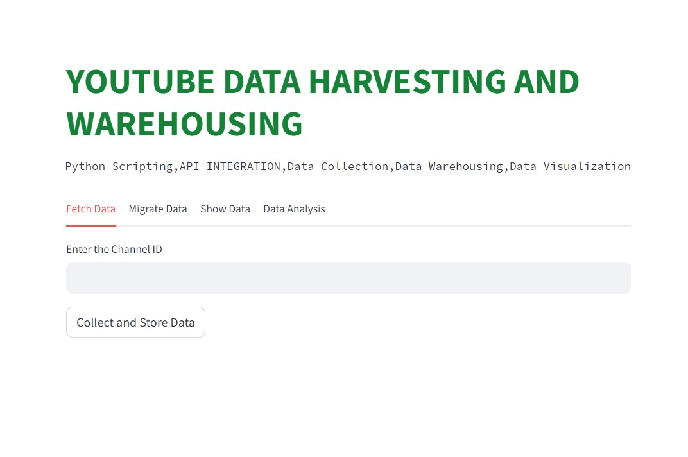

# YouTube Data Harvesting and Warehousing

**Introduction:**

This project focuses on developing a user-friendly Streamlit application to extract insightful data from YouTube channels via the Google API. The gathered data is initially stored in MongoDB and subsequently migrated to a SQL data warehouse for advanced analysis and exploration, all seamlessly accessible through the Streamlit interface.

**Technologies Used:**

* Python scripting for data manipulation and analysis.
* Google API integration for data extraction from YouTube channels.
* Streamlit for creating an interactive and user-friendly interface.
* MongoDB for efficient data storage and retrieval.
* MySQL for structured data warehousing.
* Libraries such as pandas, matplotlib, seaborn for data management and visualization.

**Installation**

To run this project, ensure the following packages are installed:
   
    import pandas as pd
    from googleapiclient.discovery import build
    import pymysql
    import pymongo
    import streamlit as st
    import matplotlib.pyplot as plt
    import seaborn as sns

**Key Features**

* Comprehensive retrieval of data from YouTube API, including channel details, playlists, videos, and comments.
* Efficient storage of data in MongoDB with the provision to check for existing channel data.
* Seamless migration of data from MongoDB to MySQL data warehouse.
* Analysis and visualization of data using Streamlit, Plotly, and other visualization libraries.
* Querying capabilities on the MySQL data warehouse.
* Display of channel names along with subscription and view counts.

**Data Retrieval and Storage**

Utilizing the Google API, the project extracts comprehensive data from YouTube channels, covering various aspects such as channel information, playlists, videos, and comments. The retrieved data is efficiently stored in a MongoDB database.

**Data Migration and Analysis**

The application facilitates the migration of data from MongoDB to a MySQL data warehouse. Data cleansing and structuring are performed using pandas, ensuring compatibility with a structured format. The information is then segregated into separate tables (channels, playlists, videos, comments) using MySQL queries.

**Data Analysis and Visualization**

The project offers robust data analysis capabilities using libraries such as Plotly and Streamlit. Users can view visually appealing charts to gain insights from the collected data.

**Conclusion**

In summary, this project offers a comprehensive solution for collecting, storing, and analyzing data from YouTube channels. The integration of MongoDB for initial storage and MySQL for structured data warehousing facilitates seamless data transition and exploration. The use of advanced visualization libraries enhances data understanding and supports data-driven decision-making.

**User Interface**

**GitHub Repository**

Explore the code and contribute to the project on GitHub:

https://github.com/akshaya-m-08/Akshaya---AI-ML.git

